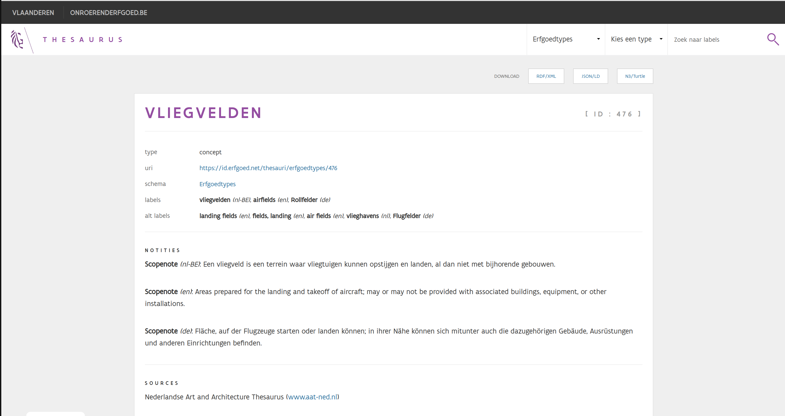
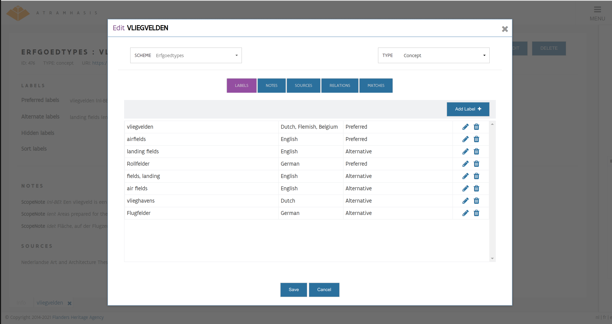
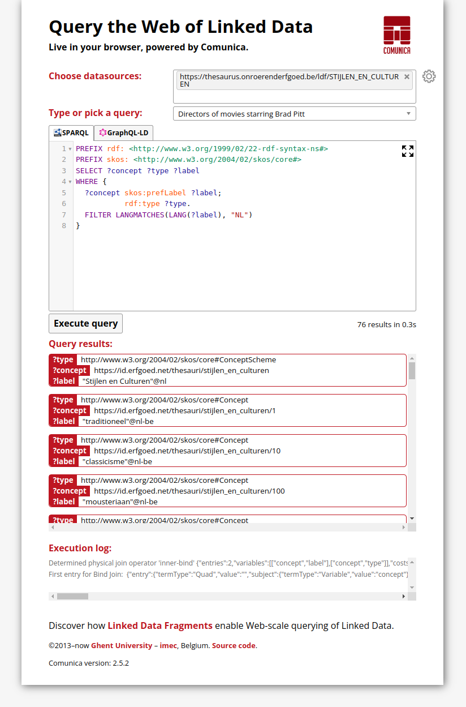
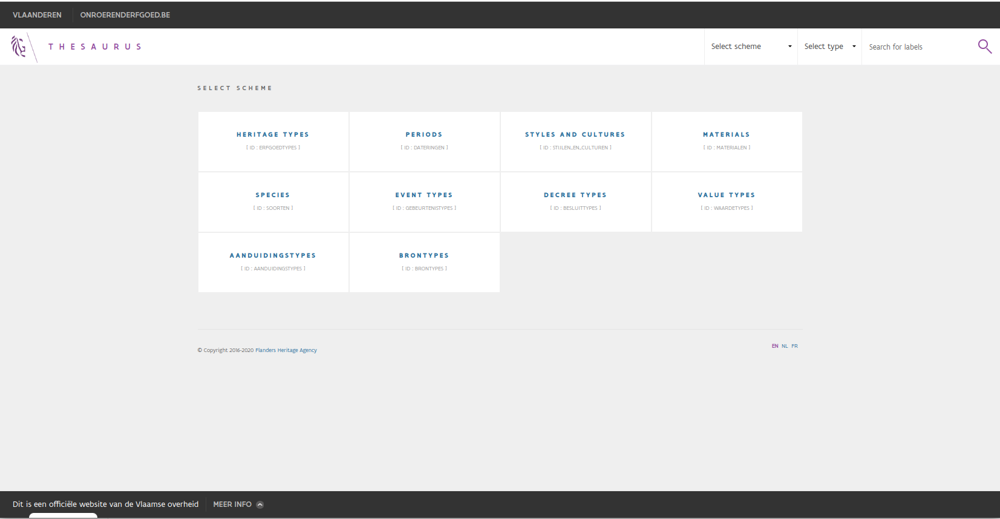

# Summary

Atramhasis is an online vocabulary editor that allows users to create, maintain 
and consult controlled vocabularies and thesauri [@Harpring:2010] according to 
the SKOS specification [@skos:2008]. SKOS (Simple Knowledge Organisation System) is a 
W3C Recommendation that supports controlled vocabularies within the framework of the 
Semantic Web. SKOS provides a standard way to represent these vocabularies using RDF 
(Resource Description Framework) [@rdf:2014], another W3C Recommendation that allows
passing data between computer applications in an interoperable way.  

SKOS vocabularies record controlled vocabularies as a set of concepts, collections
and their relations. A concept being something a researcher wants to describe and define,
a collection being a grouping of a number of concepts.
Flanders Heritage is active in the domain of cultural heritage and 
describes concepts such as [Roman period](https://id.erfgoed.net/thesauri/dateringen/1223) [@Slechten:2004],
[oppida](https://id.erfgoed.net/thesauri/erfgoedtypes/1052) or 
[archaeological excavations](https://id.erfgoed.net/thesauri/gebeurtenistypes/38). A 
typical collection would be [settlements by function](https://id.erfgoed.net/thesauri/erfgoedtypes/1034), 
a grouping of settlement types according to their function, as opposed to by size or form. 
Similar concepts and collections are grouped in a conceptscheme, eg. the 
conceptscheme of [heritage types](https://id.erfgoed.net/thesauri/erfgoedtypes)
consists of concepts and collections that describes types of heritage, ranging from 
[solitary trees](https://id.erfgoed.net/thesauri/erfgoedtypes/1654) 
over [burial mounds](https://id.erfgoed.net/thesauri/erfgoedtypes/170)
 to [airfields](https://id.erfgoed.net/thesauri/erfgoedtypes/476) 
and [swimming pools](https://id.erfgoed.net/thesauri/erfgoedtypes/949). Concepts 
and collections can be labelled with preferred labels and alternative labels, 
more elaborately described with definitions and notes, and provided with references 
to source material. The concepts can be related, in general or in a hierarchical way 
(broader/narrower), to other concepts and collections in the same vocabulary or 
to concepts in other vocabularies such as the Art and Architecture Thesaurus (AAT) [@aat].

# Functional requirements

Atramhasis was written to be a user-friendly open source SKOS editor. First and 
foremost, we wanted a system that adheres to the SKOS standard, yet is useable 
for users without knowledge of SKOS or RDF. For a typical user, it had to feel 
as if they were consulting a normal website, as opposed to a RDF vocabulary 
since the latter can feel rather daunting to non-technical users. This not only 
applies to users consulting the thesauri, but also to those editing them. Our 
thesaurus editors are not IT- or linked data specialists, but domain experts, 
researchers and other specialists in the field of cultural heritage. While a 
general understanding of thesauri is within their grasp, the technicalities of 
RDF are not. Thus, editors in Atramhasis do not write RDF statements, but edit 
data in a normal web admin interface, as seen in \autoref{fig:editingairfields}. 
All mapping to RDF and SKOS is done behind the scene, invisible to the editors.

The system was conceived as Flanders Heritage's 
[central platform](https://thesaurus.onroerenderfgoed.be) for publication of 
internal and regional vocabularies dealing with cultural heritage [@Mortier:2017]. 
The publication website allows humans to browse, search and consult the vocabularies 
online in a user-friendly way. Search results can be downloaded in CSV format 
for further processing. Internal and external systems use the webservices provided 
by Atramhasis to consult or download vocabularies. Concept URIs are used in 
indexing data in systems such as the 
[Inventory of Immovable Cultural Heritage](https://inventaris.onroerenderfgoed.be) 
[@VanDaele:2015; @deHaan:2021; @Hooft:2021] or the 
[Flanders Heritage Image Database](https://beeldbank.onroerenderfgoed.be).
This allows users to search those systems using the provided thesauri (\autoref{fig:searchingairfields}).
For a typical end-user the thesauri are presented as dropdown lists or 
[specialised widgets](https://github.com/OnroerendErfgoed/thesaurus-widget) that 
allow navigating the thesaurus from the top concepts along branches to the leafs. 
For most transactions between internal Flanders Heritage systems and the
thesaurus system, simple JSON REST services are used. This was deliberately 
modelled on the implementation standards used in other Flanders Heritage sytems.
This allows developers used to working in an enterprise IT context to feel 
comfortable and productive.

While interactions with internal system are done through plain JSON REST
services, publishing of linked data for external consumption is also supported.
Individual concepts and collections can be downloaded as RDF data in Turtle, 
RDF/XML and JSON-LD format [@jsonld:2020]. Entire conceptschemes can be downloaded 
in Turtle or RDF/XML format. Finally, an 
[integration with a Linked Data Fragments (LDF) server](https://atramhasis.readthedocs.io/en/latest/development.html#running-a-linked-data-fragments-server) 
can be set up. An LDF server such as the 
[Flanders Heritage Thesaurus LDF server](https://thesaurus.onroerenderfgoed.be/ldf/)
can be browsed online for basic usage, but really shines in combination with an 
LDF client (\autoref{fig:comunica}) such as [Comunica](https://comunica.dev/) 
[@Taelman:2018]. Such a client provides a full SPARQL interface to the thesauri 
in Atramhasis through the [Triple Pattern Fragments](https://linkeddatafragments.org/in-depth/#tpf)
protocol [@Verborgh:2016]. This combination provides the power of SPARQL queries
without having to setup a triplestore, thus keeping the required technology stack 
small. Implementors needing a full triplestore, could easily add one and use the 
export capabilities provided by Atramahsis to populate the triplestore. 

An Atramhasis instance can be connected to external vocabularies and thesauri through 
an interface called a Skosprovider [@skosprovider:2022]. Any thesaurus providing one can 
be used for linking external concepts. Out of the box skosproviders are available for Getty 
vocabularies such as the AAT [@aat] or other Atramhasis instances, but any thesaurus adhering 
to the SKOS standard can be added with a little development work. Connecting an external 
thesaurus opens up the possiblity of interlinking internal and external thesauri, importing 
concepts from such a thesaurus and turning your vocabularies into true linked data. 

# Technical requirements

When considering an IT-project, we take into account both functional and 
non-functional requirements. These are less about what the software does, 
and more about how it does it.

As a government agency, Flanders Heritage has it's own corporate identity, part
of the wider branding of the Flemsish Government. Therefore, Atramhasis comes 
with a default style but is easy to extend with a custom corporate identity. This
can be seen by comparing the [Flanders Heritage thesaurus](https://thesaurus.onroerenderfgoed.be) 
with the default Atramhasis setup.

We needed software that was easy to integrate with our regular authentication 
and authorisation mechanism, a single sign-on environment used by most Flemish 
Government agencies. Therefore, Atramhasis does not come with a default 
authentication and authorization layer, but the underlying 
[Pyramid framework](https://trypyramid.com) provides hooks and integration points 
facilitating this. There are default libraries for this framework that can be 
configured according to a user's own corporate security needs.

Our normal RDBMS of choice is [PostgreSQL](https://postgresql.org), but we 
try not to become too dependent on one single piece of technology. We use
[SQLAlchemy](https://sqlalchemy.org), a database abstraction layer, so
Atramhasis can be run with different RDBMS backends. While the list 
of backends SQLAlchemy supports is long, for Atramhasis we run integration tests 
on two different open source backends. The first, [PostgreSQL](https://postgresql.org) 
is well suited for an enterprise multi-user production environment such as the 
Flanders Heritage thesaurus. It has been running our production 
environment for years, serving 25.000 visitors annually. 
The second, [SQLite](https://sqlite.org), is very well 
suited for a single-user environment and rapid prototyping. By using this very 
simple file-based RDBMS and not configuring any authentication you can use Atramhasis 
as a local SKOS editor on any machine that has a recent Python evironment
installed. People who did not want to write SKOS files by hand have used it 
in this way as a quick SKOS editor.
 
Since we already had mutiple thesauri, a single instance of Atramhasis can host
multiple conceptschemes (\autoref{fig:conceptschemes}). Creating a conceptscheme requires 
somewhat more work than creating a concept or collection. Generally it is 
best left to system admins and IT-experts who can also setup a URI generation scheme 
and [handler](https://https://github.com/OnroerendErfgoed/urihandler), decide on 
some special configuration settings and know how the conceptscheme will be used in other 
applications. While this previously needed to be done by writing a small piece 
of code, version 2.0.0 will provide a web interface for this. We still recommend 
consulting a systems architect when creating new thesauri, especially if they are 
meant to be integrated in a wider enterprise architecture.

Finally, we knew our thesauri were fairly small. The largest Flandes Heritage 
conceptscheme holds some 1.485 concepts. Bigger 
conceptschemes are certainly possible, but no upper limit has been reached so 
far and the software itself has no hardcoded limit. However, we do feel Atramhasis 
is not ideal for hosting very large thesauri such as the AAT [@aat]. Often such a 
thesaurus defines custom properties or has smaller subgroups to keep the thesarus 
navigable. At Flanders Heritage we have avoided creating heterogenous conceptschemes, 
opting for conceptschemes with a tight focus. Eg. the Flanders Heritage thesaurus 
has different conceptschemes that each map to an AAT subgroup called a Facet 
(Styles and Periods, Activities, Materials, Objects). While the end result is very 
similar, Atramhasis does not currently support something like the facets the 
AAT employs to organise concepts in different subgroups within a single 
conceptscheme. So far, this has not proved to be an issue.

# State of the field

Having decided on our functional and technical requirements, we surveyed vocabulary 
software available at the time (2014). Knowing we need to integrate existing 
software in our normal technical environment, requiring a great degree of flexibility 
and customisation, we focussed our search on open source software.

Software like [Protégé](https://protege.stanford.edu/) offers a lot of 
functionality for building RDF vocabularies, but is not suited for editing by 
non-technical users. Collaboration would have required all editors to be 
proficient in version control systems such as [Git](https://git-scm.com). A similar
limitation is shared with a project such as [SkoHub](https://skohub.io/). Others
projects such as [Skosmos](https://skosmos.org/) provide for publication of 
thesauri, but not editing. A true online editor such as
[TemaTres](https://vocabularyserver.com/web/) had a more user-friendly interface,
but was difficult to evaluate properly since most of the documenation and code 
was in Spanish. It also diverged from our technology stack, although we did 
have some older projects using similar technologies.
[OpenSkos](https://openskos.org) also diverged from our technology stack, 
and was lacking good documentation so it was unclear how easy it would be
to customise and adapt the software to our corporate identity. [iQvoc](https://iqvoc.net) 
had exactly the kind of end-user experience we were looking for. Unfortunately we 
were not at all proficient in Ruby. iQvoc also runs on the idea that every 
conceptscheme requires a new instance of the application, which would have 
required a lot of work whenever a new scheme was needed. None of the available
solutions had a ready-made integration with our single sign-on environment
or made it easy to build one. Adding our own corporate identity would have 
have been feasible in some ways, but often it would have to be done by forking
the software as opposed to configuring it, complicating long term maintenance.

# Conclusion

After careful consideration of our functional and technical requirements and the
available software we found, we decided to write a simple but extensible editor 
in Python. We felt this was the best way to make sure we could support all our 
use cases in a sustainable way. So far this has proven to be the right decision.
 
# Acknowledgements

As with any long lived project, Atramhasis has benefitted from the input of 
several colleagues and software developers over the years. While it's impossible 
to thank them all, we do want to thank Bart Saelen, Tinne Cahy and 
Cedrik Vanderhaegen for much of the original development. A full list of people 
who contributed over the years can be found on GitHub. Leen Meganck and 
Sophie Mortier were responsible for building most of the vocabularies that led to 
creating the software. Their needs and requirements drove the features of Atramhasis.

# References
